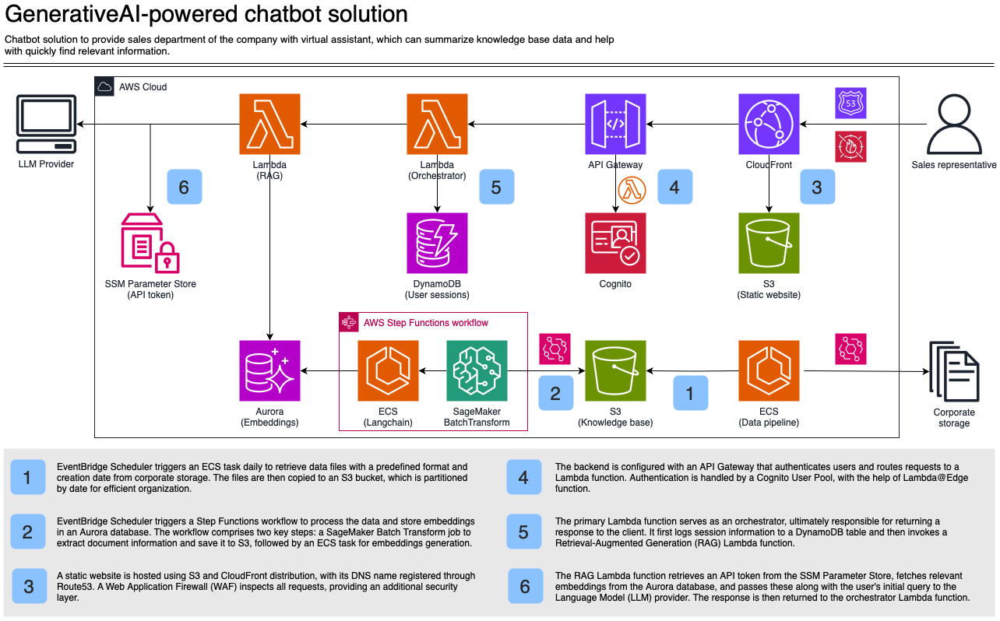
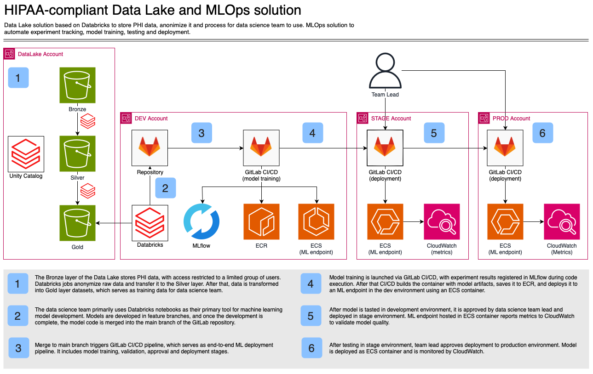
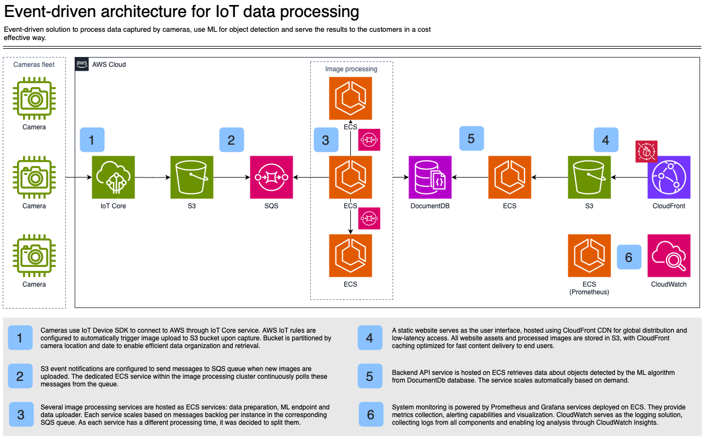
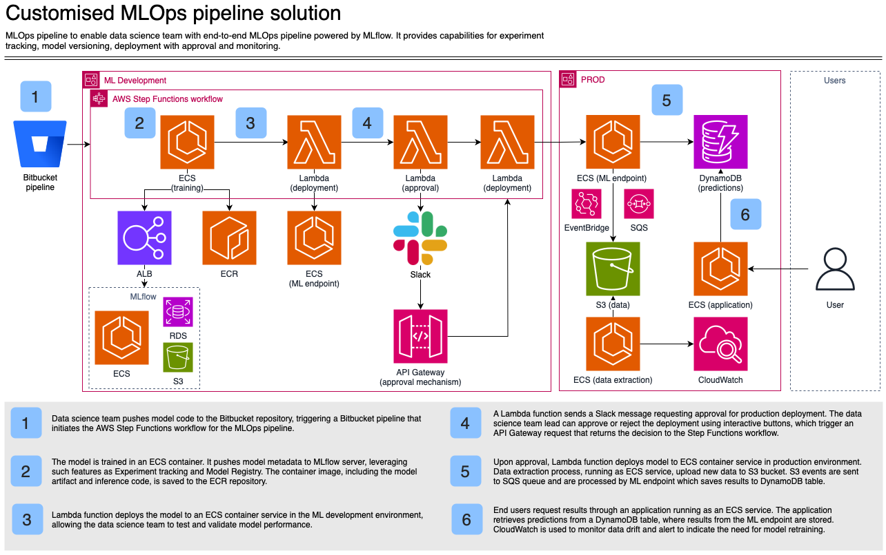
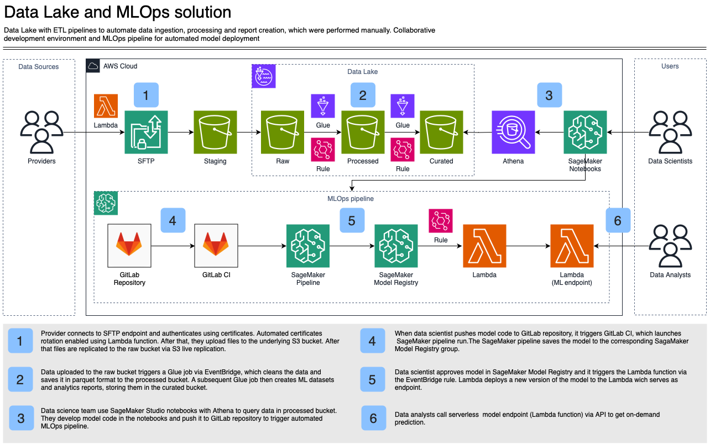
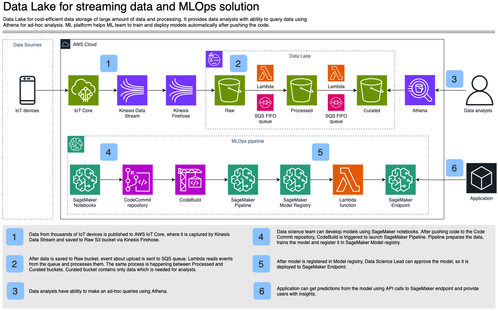

# Zeeshan Ashraf
### Senior AWS DevOps Architect | High-Availability & Cost Optimization | [LinkedIn](https://www.linkedin.com/in/zeeshan-ashraf-dev/)

I help SaaS & AI startups build secure, scalable AWS cloud infrastructure 
that delivers 99.99% uptime, supports rapid growth, and reduces cloud 
costs by 30–40%.

AWS Certified Solutions Architect | 8+ Years of Production DevOps & 
Cloud Architecture Experience

Focus areas:
- Cloud Architecture: Multi-AZ deployments, disaster recovery & 99.99% uptime design
- Infrastructure as Code: Terraform with fully reproducible environments
- Kubernetes & Containers: EKS cluster architecture & production orchestration
- CI/CD Automation: Zero-downtime, Blue/Green & Canary deployments
- Observability: CloudWatch, Prometheus, Grafana, ELK, Datadog & PagerDuty
- Security & Compliance: IAM, encryption, HIPAA / SOC 2 / GDPR automation
- Cost Optimization: 30–40% AWS spend reduction via Reserved Instances, 
  Spot & autoscaling strategies

Case Study: Reduced AWS bill by 38%, increased uptime from 
99.5% → 99.99%, implemented multi-AZ failover & built CI/CD pipeline.

Monthly DevOps Partnership Plans available — ongoing optimization, 
cost audits, incident response & scaling strategy.

# Projects
**All case studies represent anonymized client work. Specific implementations and business details have been generalized to protect client confidentiality.**

## 🏛 GenerativeAI-powered chatbot solution
**Industry:** Retail

### Problem
The company's sales department has a large knowledge base that stores data about the solutions previously developed by the company. With time passing, it becomes harder to navigate and find relevant information, so they want a solution that can find relevant information based on request.

### Solution
The solution implements a serverless RAG (Retrieval-Augmented Generation) architecture that combines enterprise knowledge bases with LLM capabilities, enabling sales teams to access accurate information through natural language queries.

**Data Ingestion & Knowledge Base**: Corporate documents are stored in S3, partitioned by date for efficient organization. EventBridge Scheduler triggers daily ECS tasks that retrieve files in predefined formats and generate creation dates. A Step Functions workflow orchestrates the data pipeline — SageMaker Batch Transform extracts document information and structures it for S3 storage, followed by an ECS task that generates embeddings and persists them in Aurora PostgreSQL using the pgvector extension.

**Processing Architecture**: The backend uses API Gateway to authenticate users through Cognito User Pool and route requests to Lambda functions. The primary orchestrator Lambda logs sessions to DynamoDB, then invokes a RAG Lambda that retrieves the API token from SSM Parameter Store. This RAG function fetches relevant embeddings from Aurora and passes them with the user's query to the LLM provider, returning contextually-grounded responses rather than generic answers. Lambda handles the API layer with ~1s cold starts on first requests — acceptable for the sales team's query pattern of 20-30 daily searches — delivering 70% cost savings versus always-on ECS containers.

**Frontend & Security**: A static website hosted on S3 and distributed via CloudFront provides global low-latency access. Route53 handles DNS with a registered domain, while WAF adds an additional security layer by inspecting requests at the edge before they reach the application.

 

My responsibilities included:
- Led cross-team communication to align requirements between multiple stakeholders
- Designed RAG-powered chatbot architecture with session persistence for contextual interactions
- Architected cost-effective static website hosting solution with Cognito authentication
- Engineered automated data pipeline for continuous knowledge base updates
- Created technical documentation including architecture diagrams, effort estimates, and TCO calculations

**Technology stack:** CloudFront, Cognito, API Gateway, Lambda, ECS, DynamoDB, Aurora, S3.

## 🏛 HIPAA-compliant Data Lake and MLOps solution
**Industry:** Healthcare

### Problem
A healthcare company wants to have a data lake for cross-team usage. As they collect PHI data, the solution should be compliant with HIPAA requirements and data should be anonymized before it can be used by the teams. Also, the company wants to have a unified development environment with Spark capabilities for data science and data engineering teams.

### Solution
The solution implements a multi-layered data lake architecture with integrated MLOps workflows, enabling secure PHI data storage with progressive refinement while automating the complete ML lifecycle from experimentation to production deployment.

**Data Lake Architecture**: Databricks serves as the unified analytics platform with a three-tier medallion architecture. The Bronze layer ingests raw PHI data with restricted access, applying anonymization before promotion. The Silver layer stores cleaned, validated data suitable for analytics. The Gold layer contains feature-engineered datasets optimized for ML training, accessible to the data science team through Databricks notebooks for model development. Databricks was chosen over self-managed Spark to eliminate 15+ hours weekly of cluster management, accepting vendor dependency for HIPAA-compliant access controls and unified governance through Unity Catalog that would require significant custom development otherwise.

**MLOps Pipeline - Development**: The workflow begins with feature development in isolated branches within the DEV GitLab repository. Merging to main triggers GitLab CI/CD pipeline that orchestrates model training through MLflow experiment tracking and registers models in ECR. ECS ML endpoints in the dev environment execute training jobs, with results logged back to MLflow for comparison and versioning.

**MLOps Pipeline - Deployment**: After development testing, approved models progress to the STAGE GitLab repository, where CI/CD automatically deploys ML endpoints as ECS containers. CloudWatch collects metrics to validate model quality against production thresholds. Upon team lead approval, the model advances to the PROD GitLab repository, triggering final deployment to production ECS endpoints with continuous CloudWatch monitoring. ECS hosts ML endpoints rather than SageMaker to maintain consistency with the existing container deployment workflow.

**Governance & Access Control**: Unity Catalog enforces fine-grained access control across all data lake layers, ensuring HIPAA compliance through role-based permissions and audit logging. S3 data is encrypted with KMS customer-managed keys, the Databricks workspace runs in a private VPC, and CloudTrail provides comprehensive audit trails for all PHI access.

My responsibilities included:
- Gathered requirements from multiple teams and ensured cross-team alignment
- Designed HIPAA-compliant data lake with three-tier medallion architecture and anonymization pipeline
- Configured Databricks environment for data science and engineering teams
- Designed and implemented end-to-end MLOps pipeline with multi-environment approval workflows
- Established monitoring for ML endpoints and created dashboards for the data science team
- Created comprehensive documentation including architecture diagrams, ADRs, TCO analysis, and usage guidelines

**Technology stack:** Databricks, S3, ECS, ECR, CloudWatch, CloudTrail, KMS, GitLab.

## 🏛 Event-driven architecture for IoT data processing
**Industry:** Agriculture 

### Problem
High infrastructure cost of the current architecture and difficulties with maintaining containers deployment to EC2 instances were two main drivers for re-design. Team needs solution which would be able to reuse their code base and migrate to new architecture as quickly as possible.

### Solution
The solution implements an **event-driven processing pipeline** that decouples data ingestion from compute-intensive ML processing, enabling independent scaling and cost optimization.

**Data Ingestion & Event Flow:** Camera fleet connects via IoT Core, which automatically triggers S3 uploads upon image capture. S3 buckets are partitioned by camera location and date for efficient retrieval. Rather than continuous polling, S3 event notifications are configured to push messages into SQS queues.

**Processing Architecture:** The image processing workload runs as ECS services in a dedicated cluster, each pulling from the same SQS queue. Moving from EC2 to Fargate allowed the team to reuse existing container code with zero infrastructure management, achieving 60% cost reduction by eliminating idle time. ML pipeline is split into separate services (data preparation, ML inference, data upload) rather than a monolithic container, enabling independent scaling per stage — preprocessing runs 2 containers while ML inference scales to 8 containers based on processing time requirements.

**Data Storage & Delivery:** Processed results land in DocumentDB, which replaced self-managed MongoDB to eliminate operational burden and achieve 40% cost savings while maintaining full query compatibility. The frontend is a static site on S3 served through CloudFront CDN, with assets cached at edge locations for global low-latency access.

**Observability:** Prometheus and Grafana are deployed on ECS for custom metrics collection, complementing CloudWatch for logging. This approach gives deep visibility into infrastructure and model performance.

 

My responsibilities included:
- Analyzed existing architecture and codebase to identify cost optimization opportunities
- Designed event-driven architecture with detailed effort and TCO estimations
- Created IaC repository structure and conducted workshops on Terraform/Terragrunt best practices
- Implemented Terraform configurations for core infrastructure components
- Optimized service configurations and eliminated unused resources to reduce operational costs

**Technology stack:** IoT Core, ECS, DocumentDB, S3, CloudFront, SQS, CloudWatch, Prometheus.

## 🏛 Customised MLOps pipeline solution
**Industry:** Media \
**My similar open-source project:**  [MLOps serverless pipeline](https://github.com/ChildishGirl/mlops-serverless-pipeline)

### Problem 
The data science team prefers to use IDE as the ML development environment but still needs an automated process to train, register, and deploy models.

### Solution
The solution implements an end-to-end MLOps pipeline with human-in-the-loop approval, enabling automated model training, versioning, and deployment while maintaining governance through Slack-based approval workflows and comprehensive monitoring.

**Development Workflow**: Data scientists push model code to Bitbucket, triggering a Step Functions workflow that orchestrates the ML pipeline. ECS containers handle model training, pushing metadata to MLflow for experiment tracking and model artifacts to ECR. The trained model is deployed to an ECS ML endpoint in the development environment for validation. MLflow, backed by RDS and S3, provides centralized tracking of experiments, parameters, and model lineage through an ALB-accessible interface. Self-hosted MLflow on ECS was chosen over SageMaker Tracking Server, saving approximately $800 monthly for the small team's experiment volume while accepting operational overhead of maintaining RDS and ALB infrastructure — justified by the team's existing container management expertise.

**Approval Mechanism**: A Lambda function sends Slack notifications to the data science team lead with interactive buttons for deployment approval. The API Gateway-backed approval mechanism captures decisions and triggers the next Step Functions workflow stage. This human-in-the-loop pattern ensures only validated models progress to production, maintaining quality gates while keeping the process asynchronous and non-blocking.

**Production Deployment**: Upon approval, a Lambda function deploys the model as an ECS container service in the production environment. A parallel data extraction process running on ECS uploads new training data to S3 and pushes events to SQS queues. EventBridge monitors these events, enabling automated retraining triggers. The ML endpoint processes inference requests and stores predictions in DynamoDB for audit trails and serving.

**Monitoring & Feedback Loop**: CloudWatch tracks model performance metrics and data drift. End users interact with the model through an ECS-hosted application that retrieves predictions from DynamoDB, where results from the ML endpoint are stored. This architecture enables continuous monitoring to detect when model retraining is needed based on performance degradation.

 

My responsibilities included:
- Gathered requirements to determine appropriate AWS architecture for IDE-based ML development
- Designed on-demand MLOps pipeline with self-hosted MLflow for cost optimization
- Implemented Slack-based model approval workflow with human-in-the-loop pattern
- Established experiment tracking and model versioning with synchronized artifact and container versions
- Designed CloudWatch-based monitoring solution for data drift detection and retraining alerts

**Technology stack:** ECS, Lambda, DynamoDB, API Gateway, EventBridge, CloudWatch, BitBucket.

## 🏛 Data Lake and MLOps Solution
**Industry:** Hospitality

### Problem 
The data engineering team spent 15+ hours weekly manually extracting data from provider emails, delaying critical business reports by 3-5 days. Without centralized data storage, multiple teams maintained duplicate datasets, creating version conflicts and inconsistencies. The data science team lacked a unified development environment, forcing manual model deployment processes prone to configuration errors and version mismatches between training and production environments.

### Solution
The solution implements an automated data lake with ETL pipelines and integrated MLOps workflows, transforming manual data processing into a self-service analytics platform with automated model deployment and serving capabilities.

**Data Ingestion & Lake Architecture**: Providers connect to SFTP endpoints with certificate-based authentication, with Lambda handling automated certificate rotation for security. Files land in a staging S3 bucket before replication to the raw layer. EventBridge triggers Glue jobs that clean and transform data into Parquet format, with subsequent Glue jobs creating ML-ready datasets and analytics reports stored in the processed bucket. A final transformation produces curated datasets in the curated bucket, optimized for consumption.

**Analytics & Development**: Data scientists access processed data through SageMaker Studio notebooks, querying datasets via Athena's serverless SQL engine without managing infrastructure. This self-service approach eliminates manual data preparation bottlenecks and enables rapid experimentation directly on lake data.

**MLOps Pipeline**: Code pushed to GitLab repository triggers GitLab CI, launching SageMaker Pipeline for automated model training with hyperparameter tuning and validation. Trained models register in SageMaker Model Registry with versioning and metadata tracking. EventBridge rules monitor model approval status — when data scientists approve a model in the registry, it triggers a Lambda function that deploys a new model version as a serverless Lambda endpoint.

**Model Serving**: Data analysts invoke the Lambda ML endpoint via API for on-demand predictions — this serverless approach eliminates always-on infrastructure costs for the team's <100 daily predictions, trading 2-3s cold start latency for 80% cost savings compared to persistent SageMaker endpoints, which was acceptable for their batch analytics workflow.

 

My responsibilities included:
- Designed automated data ingestion pipeline transitioning from manual email collection to SFTP-based system
- Architected multi-layer data lake with ETL pipelines for automated report generation and ML data preparation
- Enabled collaborative development environment for data science team using SageMaker Studio
- Designed and implemented MLOps pipeline for automated model training, registration, and serverless deployment

**Technology stack:** SFTP, S3, Glue, SageMaker, Lambda, EventBridge, GitLab.

## 🏛 MLOps and CI/CD for data pipelines
### Context 
**Industry:** Healthcare \
**My similar open-source project:**  [Data pipeline with CI/CD enabled](https://github.com/ChildishGirl/serverless-data-pipeline)

### Problem 
Manual deployment of ML models resulted in 40% of production releases failing validation due to environment configuration mismatches. The absence of automated ETL pipelines for IoT data streams created processing delays of 6-12 hours, preventing real-time analytics. Without CI/CD processes, data engineers spent 10+ hours weekly on manual testing and deployment tasks.

### Solution 
The solution implements a streaming data lake with event-driven processing and automated MLOps, enabling cost-efficient storage of high-volume IoT data while maintaining real-time processing capabilities and automated model deployment.

**Streaming Ingestion & Lake Architecture**: IoT devices publish data to IoT Core, captured by Kinesis Data Streams for real-time ingestion and delivered to raw S3 buckets via Kinesis Firehose with automatic batching for cost optimization. Rather than continuous Lambda polling, S3 event notifications push to SQS FIFO queues, decoupling ingestion from processing with ~100ms added latency but guarantee message ordering critical for time-series anomaly detection. Lambda functions consume from queues to transform data through processed and curated layers — this tiered approach balances storage costs (raw for compliance, curated for analytics) with query performance. 

**MLOps Pipeline**: Data scientists develop in SageMaker notebooks and commit to CodeCommit, triggering CodeBuild to launch SageMaker Pipeline for orchestrated training, validation, and model registration. This automation eliminates manual deployment errors while maintaining approval gates through Model Registry — Data Science Leads approve models before Lambda deploys them to SageMaker Endpoints. Using managed endpoints rather than serverless inference trades slightly higher cost for consistent low-latency predictions required by real-time applications.

**Analytics Access**: Athena provides serverless querying across all lake layers, enabling ad-hoc analysis without infrastructure overhead. Applications retrieve predictions via SageMaker Endpoint APIs for real-time insights.

 

My responsibilities included:
- Designed and implemented streaming ETL pipelines using Lambda and SQS FIFO queues
- Established CI/CD processes for data pipelines using CodeBuild and AWS CDK
- Designed MLOps pipeline with SageMaker Studio, CodeCommit, and automated model deployment
- Implemented three-tier data lake architecture with event-driven processing for IoT data streams
